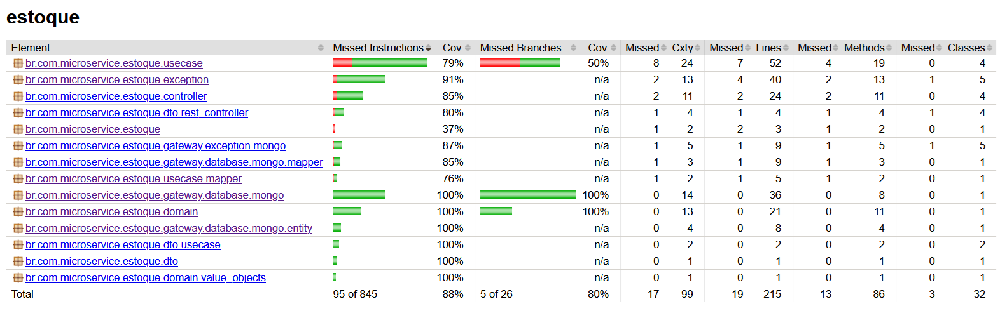

# Tech Challenge 04 - Estoque

## Introdução

Esta aplicação é parte de um sistema abrangente de gerenciamento de pedidos e estoque construído com o framework Spring Boot. Este microsserviço específico foca em fornecer uma funcionalidade CRUD completa (Criar, Ler, Atualizar, Excluir) para o estoque de produtos.

O repositório do projeto pode ser acessado em: [https://github.com/eduardoesr/micro-estoque-clean-arch](https://www.google.com/url?sa=E&source=gmail&q=https://github.com/eduardoesr/micro-estoque-clean-arch).

## Funções

* **Criar Estoque**: Permite a criação de novas entradas de estoque de produtos.
* **Listar Estoque**: Fornece endpoints para recuperar informações de estoque, incluindo a listagem de todas as entradas de estoque.
* **Atualizar Estoque**: Permite a modificação de informações de estoque de produtos existentes, incluindo a redução e adição de quantidade.
* **Excluir Estoque**: Suporta a remoção de entradas de estoque de produtos.

## Tecnologias

As seguintes tecnologias são utilizadas neste projeto:

* **Spring Boot**: Framework web para construção da aplicação.
* **Maven**: Gerenciador de dependências para o projeto.
* **Swagger**: Utilizado para documentação da API e interface de testes.
* **MongoDB**: Banco de dados NoSQL para persistência de dados.

## Instalação

Para configurar e executar o projeto, siga estes passos:

1.  **Instalar Docker Desktop**: Certifique-se de que o Docker Desktop esteja instalado em seu sistema.
2.  **Clonar o Repositório**: Baixe os arquivos do projeto do repositório: `https://github.com/eduardoesr/micro-estoque-clean-arch`.
3.  **Navegar até a Pasta do Repositório**: Mude seu diretório para o repositório clonado: `cd micro-estoque-clean-arch`.
4.  **Executar o Projeto com Docker Compose**: Execute o projeto usando Docker Compose, que configurará o microsserviço Spring Boot e o banco de dados MongoDB. Use o seguinte comando em seu terminal: `docker-compose up --build`.

Esta configuração do Docker Compose executará o microsserviço Spring Boot juntamente com o banco de dados MongoDB.

A interface do Swagger pode ser acessada diretamente em `http://localhost:8084/swagger-ui.html`.

## Banco de Dados

A entidade principal no banco de dados é `EstoqueProduto`.

| Campo      | Descrição                                  |
|------------|--------------------------------------------|
| `id`       | Identificador único do estoque do produto. |
| `sku`      | Código SKU único do produto.               |
| `quantidade` | Quantidade atual do produto em estoque.    |

***

### Cadastrar estoque `POST /create-estoque-produto`
```
{
    "sku": "EX-SKU-123",
    "quantidade": 100
}
```

### Apagar estoque `DELETE /delete-estoque-produto/{id}`

### Obter estoque de produto específico `GET /estoque-produto/{id}`

### Listar produtos do estoque `GET /estoque-produto`
```
{
  "page": 0,
  "size": 10
}
```

### Abate a quantidade especificada do estoque dos produtos `PUT /update-estoque-produto`
```
{
  "produtos": [
    {
      "sku": "EX-SKU-123",
      "quantidade": 1000
    }
  ]
}
```

### Atualizar estoque de um produto `PUT /update-estoque-produto/{id}`
```
{
  "sku": "EX-SKU-123",
  "quantidade": 1000
}
```

### Adiciona a quantidade especificada do estoque dos produtos `PUT /update-estoque-produto/adicionar`
```
{
  "produtos": [
    {
      "sku": "EX-SKU-123",
      "quantidade": 1000
    }
  ]
}
```
***

## API

### Produto

| Método  | URL                            | Ação                                                        |
|---------|--------------------------------|-------------------------------------------------------------|
| POST    | /create-estoque-produto                | Cria um novo produto no estoque.                                       |
| DELETE  | /delete-estoque-produto/{id}           | Apaga produto do estoque pelo ID.                                      |
| GET     | /estoque-produto                       | Obtém todos os produtos do estoque.                                    |
| GET     | /estoque-produto/{id}                  | Obter produto do estoque pelo ID.                                      |
| PUT     | /update-estoque-produto                | Reduz essa quantidade dos produtos especificados                             |
| PUT     | /update-estoque-produto/{id}                | Atualiza dados de estoque de um produto                             |
| PUT     | /update-estoque-produto/adicionar                | Adiciona quantidade no estoque de um produto                             |

***

## Qualidade de software

### Testes

Foi realizado testes na API, buscando alcançar mais de 80% de cobertura

<div align="center">
    
</div>
